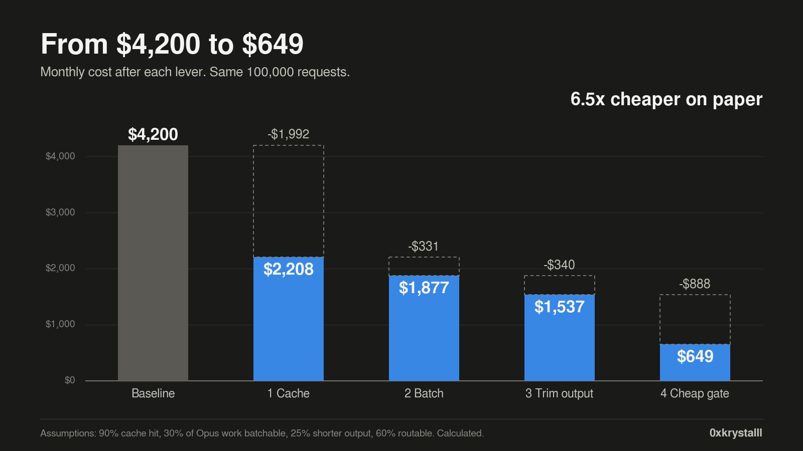

# opus-bill-calculator


A small, honest calculator and toolkit for cutting an Opus 5.5 API bill with four levers: caching, batching, shorter output, and a cheap gate in front of the expensive model.

On the example workload below, the monthly bill goes from $4,200 to $649 (6.5x cheaper). This is a CALCULATION from public list prices and stated assumptions. It is not a measurement from a real account. Change the numbers to match your traffic.



## The example workload

- 100,000 requests per month
- 6,000 tokens of stable text per request (system prompt and policy docs)
- 500 new input tokens per request
- 800 output tokens per request

| Step | Monthly cost | Saved |
|---|---|---|
| Baseline, all Opus 5.5 | $4,200 | - |
| 1. Cache the prefix (90% hit rate) | $2,208 | $1,992 |
| 2. Batch the 30% that can wait | $1,877 | $331 |
| 3. Trim Opus output by 25% | $1,537 | $340 |
| 4. Route 60% to Haiku 5.5 | $649 | $888 |

Prices used (USD per 1M tokens, checked October 2026): Opus 5.5 $4 in and $20 out, cache read $0.20, 5 minute cache write $5. Haiku 5.5 $0.10 in and $0.50 out. Batch is 50% off and stacks with caching. Always check the official pricing page before planning a budget. Sources are in [docs/sources.md](docs/sources.md).

## Quick start

```bash
git clone https://github.com/0xthugger/opus-bill-calculator.git
cd opus-bill-calculator
python3 src/cost_calc.py
```

You need nothing but Python 3.10 or newer for the calculator. To run the API scripts, also install the SDK and set a key:

```bash
pip install -r requirements.txt
export ANTHROPIC_API_KEY=your_key_here
```

Never commit your key. The `.gitignore` already skips `.env` files.

## What is in here

| Path | What it does |
|---|---|
| `src/cost_calc.py` | The calculator. Edit the five numbers at the top to match your traffic. |
| `src/cached_call.py` | Lever 1: one request with a cached stable prefix. |
| `src/batch_call.py` | Lever 2: send work that can wait through the Batch API. |
| `src/router.py` | Lever 4: a simple gate that picks the cheap or the expensive model. |
| `src/shadow_mode.py` | Safety net for lever 4: compare the cheap model with Opus on real tickets before routing anyone. |
| `examples/` | Sample tickets and a placeholder policy file. Example data only. |
| `tests/` | Tests that pin the calculator to the numbers in the table above. |
| `docs/article.md` | The full article with the reasoning behind each lever. |
| `docs/images/` | The charts used in the article. |

## Test lever 4 before you trust it

Never switch traffic on a hunch. Run shadow mode: users still get the Opus answer, the cheap model answers in the background, a judge compares the two, and you count how often the cheap answer was good enough.

```bash
python3 src/shadow_mode.py examples/tickets.example.jsonl
```

Each line of the file is a JSON object like `{"text": "..."}`. Use your own real tickets. A suggested rule: go only above 95 percent on that request class, and keep Opus as the fallback for anything under your confidence threshold.

Note: the cheap model id in `shadow_mode.py` is a placeholder. Check the exact id in your console.

## Run the tests

```bash
pip install pytest
pytest
```

## Limits

- All dollar figures are calculated from list prices and assumptions: 90% cache hit rate, 30% of Opus work batchable, 25% shorter output, 60% of requests routable to the cheap model.
- Thinking tokens are billed as output. Very tight `max_tokens` can hurt quality if the model reasons a lot.
- Prices change. This is not financial advice.

## License

MIT. See [LICENSE](LICENSE).

Built by 0xkrystalll
